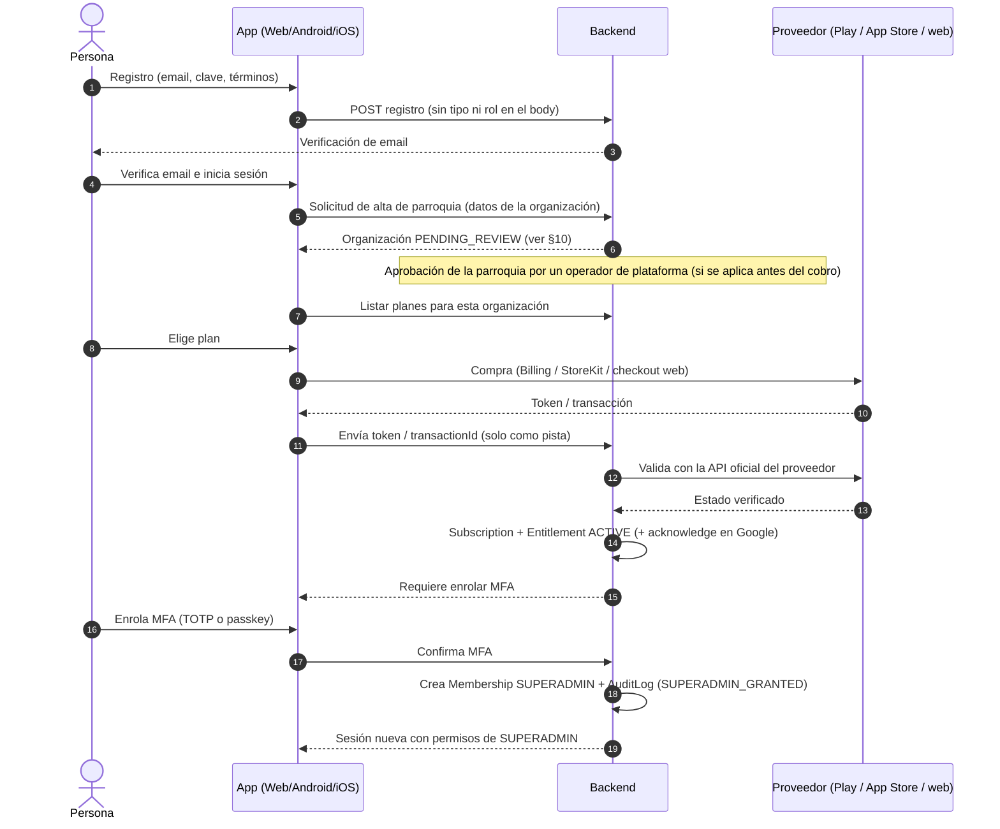

# Arquitectura de cuentas, roles y suscripciones multiplataforma

Estado: **documento de arquitectura. No hay implementación.** Fecha: 2026-10-05.
Este documento no modifica Prisma, el schema, las migraciones, los pagos, Android/Capacitor ni Neon. Cada fase de implementación requiere su propio análisis y aprobación.

> **Aviso sobre las políticas de las tiendas.** Las reglas de Google Play y Apple App Store sobre pagos de bienes digitales cambian con frecuencia y varían según la región (EE. UU., UE y otras jurisdicciones tienen regímenes distintos). Lo que este documento dice sobre ellas es la **orientación de diseño**. Antes de implementar cada plataforma hay que **verificar la política vigente** en la fuente oficial (Google Play Payments policy, App Store Review Guidelines §3.1) y dejar constancia de la fecha de consulta.

---

## 1. Punto de partida (estado real del código)

| Elemento | Estado actual | Archivo |
|---|---|---|
| `User.accountType` | Enum `STAFF` / `PILGRIM` (default `STAFF`) | `apps/api/prisma/schema.prisma` |
| `User.role` | Enum `SUPERADMIN` / `ADMIN` / `OPERATOR`, **obligatorio** en todo usuario | ídem |
| Pertenencia | `User.organizationId` obligatorio: un usuario pertenece a **una** organización | ídem |
| Registro público | `POST /register-pilgrim`: el servidor fija `accountType: "PILGRIM"` y `role: "OPERATOR"`. El body **no** define tipo ni rol. | `apps/api/src/routes/auth.ts` |
| Registro público → organización | El peregrino se asocia a la **primera organización creada** (`orderBy createdAt asc`) | ídem |
| Altas de personal | Solo por invitación; nadie invita a un nivel superior al suyo (`canGrantRole`). **Un SUPERADMIN puede invitar a otro SUPERADMIN.** | `apps/api/src/routes/invitations.ts`, `packages/shared` |
| Último superadmin | No se puede desactivar ni degradar al último SUPERADMIN activo (`LAST_SUPERADMIN`) | `apps/api/src/routes/users.ts` |
| Sesiones | Access token + `RefreshToken` en BD; sesión de peregrino separada | `apps/api/src/lib/session.ts`, `plugins/auth.ts` |
| Auditoría | `AuditLog` + helper `audit()` | `apps/api/src/lib/audit.ts` |
| MFA | **No existe** | — |
| Suscripciones / pagos de plataforma | **No existen**. `PaymentProof` es el comprobante de pago de inscripción de un peregrino a un evento, no una suscripción. | — |

Deudas que este diseño debe resolver:
1. A los peregrinos se les asigna `role = OPERATOR` solo porque el campo es obligatorio. Toda verificación de permisos de personal **debe** exigir `accountType = STAFF`, como ya hacen `plugins/auth.ts` y `users.ts`. A largo plazo el rol no debe existir para un peregrino (ver §3).
2. La asociación del peregrino a "la primera organización" no escala a varias parroquias.
3. Hoy SUPERADMIN se otorga por invitación, sin ninguna condición de suscripción.

---

## 2. Glosario y decisiones de alcance

- **Organización (parroquia):** el inquilino. Hoy es `Organization`.
- **SUPERADMIN:** el rol máximo **dentro de una organización**: gestiona usuarios, eventos, configuración y facturación de esa parroquia. **No** es un operador de la plataforma.
- **Operador de plataforma (`PLATFORM_ADMIN`, nombre propuesto):** el personal interno de Peregrinos que aprueba parroquias y da soporte. **No es un `Role` de organización**, no se obtiene por registro ni por invitación de una parroquia y **no necesita suscripción**. Se define fuera del flujo público (ver §9).
- **Suscripción:** el contrato de pago recurrente con un proveedor (Google Play, Apple o el procesador web).
- **Entitlement (habilitación):** lo que el backend concluye a partir de las suscripciones: "esta organización tiene el plan X activo hasta la fecha Y". **Es lo único que consulta el resto del sistema.**

---

## 3. Separación: identidad, rol y suscripción

Son tres ejes independientes. Ninguno se deduce de otro.

| Eje | Responde | Fuente de verdad | Cambia por |
|---|---|---|---|
| **Identidad** | ¿Quién es esta persona? | `User` (email verificado, credenciales, MFA) | El propio usuario (perfil, clave, MFA) |
| **Rol / pertenencia** | ¿Qué puede hacer y en qué organización? | Membresía usuario × organización × rol | Invitación aceptada, decisión de un SUPERADMIN, proceso de habilitación |
| **Suscripción / entitlement** | ¿Esta organización tiene un plan activo que habilita las capacidades pagas? | `Entitlement` derivado de `Subscription` validada por el backend | Eventos del proveedor de pago, validados por el servidor |

Reglas:
- **R1.** Una identidad **no** implica un rol: registrarse crea una identidad, nunca un SUPERADMIN.
- **R2.** Un rol **no** implica una suscripción: un SUPERADMIN cuya organización perdió el plan sigue siendo SUPERADMIN, pero pierde las capacidades que dependen de la suscripción (§8.4).
- **R3.** Una suscripción **no** otorga un rol por sí sola: el rol SUPERADMIN lo otorga el backend en un paso explícito, auditado y con precondiciones (§7).
- **R4.** Cada autorización evalúa los tres ejes: identidad (sesión válida, MFA si corresponde), rol (permiso) y entitlement (capacidad incluida en el plan).

Evolución propuesta del modelo (**no se implementa ahora**):
- `Membership(userId, organizationId, role, status)` reemplaza a `User.organizationId` + `User.role` y permite que una persona sea ADMIN en una parroquia y peregrino en otra.
- `Subscription(provider, providerRef, organizationId, purchaserUserId, planId, status, currentPeriodEnd, …)`: una fila por contrato con un proveedor.
- `Entitlement(organizationId, planId, status, validUntil, sourceSubscriptionId)`: la vista consolidada que consulta la aplicación.
- `BillingEvent`: un registro inmutable de cada notificación o validación recibida de los proveedores, con su payload firmado, para auditoría e idempotencia.

**Titular del entitlement: la organización** (decisión propuesta). La suscripción la compra una persona (`purchaserUserId`), pero habilita a la parroquia. Así, si cambia el SUPERADMIN no se pierde el plan, y los ADMIN/OPERATOR de la parroquia trabajan bajo ese plan sin pagar individualmente.

---

## 4. SUPERADMIN y suscripción obligatoria

- **S1.** Toda organización activa debe tener **al menos un SUPERADMIN** (la regla `LAST_SUPERADMIN` ya existe).
- **S2.** Una organización solo obtiene su **primer SUPERADMIN** si existe un **entitlement activo** validado por el backend (§7).
- **S3.** Las capacidades marcadas como pagas (crear eventos, invitar personal, exceder límites del plan, etc.; la lista exacta se define por plan) requieren `Entitlement.status ∈ {ACTIVE, GRACE}`.
- **S4.** Promover a otro usuario a SUPERADMIN dentro de la misma organización:
  - requiere entitlement activo, MFA del promotor con reautenticación reciente y MFA del promovido antes de que el rol quede efectivo;
  - **cambio respecto de hoy:** la invitación directa a SUPERADMIN queda reemplazada por este proceso, o al menos restringida a él.
  - El plan puede limitar la cantidad de SUPERADMIN por organización.
- **S5.** La suscripción es de la organización, no de cada SUPERADMIN: no se cobra por persona salvo que el plan lo defina explícitamente.

---

## 5. Plataformas

### 5.1 Web / PWA
- La compra se hace con un procesador de pagos web. **Proveedor pendiente de decisión** (por ejemplo Stripe o Mercado Pago, según los países donde se cobre).
- La confirmación llega por **webhook firmado** del procesador hacia el backend. La redirección de "pago exitoso" del navegador **no** habilita nada.
- La PWA instalada usa el mismo flujo web; no es un canal de tienda.

### 5.2 Android
- Para vender dentro de la app de Google Play suscripciones que desbloquean funciones digitales, se usa **Google Play Billing** (vía un plugin de Capacitor; elección pendiente, sin instalar).
- Validación en backend:
  - **Google Play Developer API** (`purchases.subscriptionsv2`) para consultar el estado;
  - **Real-time Developer Notifications** (Pub/Sub) para cambios de estado: renovación, cancelación, retención por falta de pago, revocación, etc.
- Toda compra nueva debe **reconocerse (acknowledge)** desde el backend después de validarla. Google reembolsa las compras no reconocidas dentro del plazo que fija (verificar el plazo vigente).
- Excepciones regionales (facturación alternativa o ofertas externas): solo si se decide usarlas y la política vigente lo permite en ese país.

### 5.3 iOS / iPhone / iPad
- Para suscripciones que desbloquean funciones digitales dentro de la app se usa **StoreKit / In-App Purchase** (StoreKit 2; plugin de Capacitor pendiente de elección).
- Validación en backend:
  - **App Store Server API** para consultar transacciones y el estado de la suscripción;
  - **App Store Server Notifications V2**, con payloads JWS firmados que el backend verifica contra la cadena de certificados de Apple.
- El cliente envía al backend el identificador de la transacción, nunca un "estoy suscrito".
- iPhone y iPad comparten el mismo binario y la misma suscripción.
- Enlaces o compras externas desde la app: la política depende de la región y del storefront y ha cambiado en los últimos años. Solo se usarán si se decide y la regla vigente lo permite.

### 5.4 Acceso multiplataforma
- Una organización con entitlement activo puede usar el servicio desde **cualquier** plataforma, sin importar dónde se compró: comprar por web y usar en iOS, o comprar en Android y usar en web.
- Las tiendas permiten, con condiciones, acceder a contenido adquirido en otro canal (por ejemplo, la cláusula de servicios multiplataforma de Apple, guideline 3.1.3). **Verificar las condiciones vigentes:** puede exigirse que la compra también esté disponible por IAP dentro de la app.
- **Una sola suscripción activa por organización.** Si ya existe una activa en otro proveedor, el backend lo informa antes de iniciar una segunda compra; la UI debe impedir la doble suscripción y avisar.
- La gestión de la suscripción (cancelar, cambiar de plan) se hace en el canal donde se compró. La app muestra el enlace correspondiente: Play, App Store o portal web.

---

## 6. El backend como autoridad

- **B1.** El estado de la suscripción **solo** lo escribe el backend, después de validar con el proveedor: API del proveedor, webhook o notificación con firma verificada.
- **B2.** Lo que reporta el cliente (recibo, token o "compra exitosa") es **una pista para que el backend consulte**, nunca un hecho que se acepta sin más.
- **B3.** **Idempotencia:** cada notificación se registra en `BillingEvent` con el identificador del proveedor; si se reprocesa, no duplica efectos. Los eventos fuera de orden se resuelven consultando el estado actual al proveedor.
- **B4.** **Reconciliación periódica:** un job consulta a los proveedores para corregir notificaciones perdidas.
- **B5.** **Entitlement derivado:** cada cambio de `Subscription` recalcula el `Entitlement` de la organización. La aplicación consulta solo `Entitlement`.
- **B6.** **Estados normalizados** (cada proveedor se mapea a ellos):
  - `ACTIVE`: habilita todo el plan;
  - `GRACE`: el proveedor reintenta el cobro y el plan sigue habilitado;
  - `ON_HOLD`: retenida por falta de pago, se restringe;
  - `PAUSED`: se restringe;
  - `CANCELED_PENDING_EXPIRY`: canceló, pero se habilita hasta el fin del período;
  - `EXPIRED`: se restringe;
  - `REVOKED`: reembolso o revocación, se restringe de inmediato.
- **B7.** Los secretos de los proveedores (cuenta de servicio de Google, clave de la App Store Server API, secretos de webhook) viven solo en el backend y nunca llegan al cliente ni al repositorio.

---

## 7. Flujo conceptual: registro → plan → compra → validación → habilitación

Precondiciones del paso final, todas verificadas en el servidor y dentro de una transacción:
1. Email verificado.
2. Entitlement `ACTIVE` de **esa** organización, validado por el backend.
3. MFA enrolado y verificado en esta sesión.
4. Organización en el estado requerido por §10.
5. La organización todavía no tiene SUPERADMIN (si ya lo tiene, aplica el proceso de promoción de §4/S4).

Si falta alguna precondición, el usuario sigue siendo una identidad sin rol de organización. Un pago validado sin las demás precondiciones queda registrado y se puede completar después.

---

## 8. Seguridad de SUPERADMIN

### 8.1 MFA obligatorio
- Es obligatorio para SUPERADMIN, y recomendado para ADMIN.
- Métodos: **passkeys/WebAuthn** (preferido) y **TOTP**. **No** se usa SMS como factor principal.
- Se entregan códigos de recuperación de un solo uso, guardados con hash.
- Sin MFA activo, el rol SUPERADMIN no se ejerce: la sesión solo permite completar el enrolamiento.

### 8.2 Reautenticación (step-up)
Antes de cualquier acción sensible se exige un MFA reciente, de no más de 5 a 10 minutos (valor a definir):
- otorgar o quitar roles;
- cambiar el plan o la facturación;
- transferir la titularidad;
- exportar datos personales;
- desactivar usuarios;
- eliminar o cancelar eventos;
- cambiar el email o la clave;
- desactivar el MFA.

### 8.3 Sesiones cortas
- Access token de 10 a 15 minutos.
- Refresh token **rotativo**, con detección de reutilización: si se reutiliza un refresh token ya consumido, se revocan todas las sesiones del usuario. Ya existe `RefreshToken` como base.
- Para SUPERADMIN: inactividad máxima de unos 30 minutos y duración absoluta de unas 12 horas (valores a definir).
- Revocación de todas las sesiones al cambiar la clave o el MFA, o al quitar el rol.
- Pantalla de "sesiones activas" con opción de cerrarlas.

### 8.4 Pérdida del entitlement
- Los datos de la organización **no se borran**.
- Las capacidades pagas quedan bloqueadas y la organización pasa a solo lectura.
- **Decisión pendiente:** cómo se protege un evento `IN_PROGRESS` (por ejemplo, que los check-ins sigan operativos hasta que el evento termine), para no cortar la operación en el terreno.

### 8.5 Auditoría
Se registra en `AuditLog` (append-only) quién lo hizo, cuándo, la IP o el dispositivo y el antes/después de:
- alta de SUPERADMIN, promociones y degradaciones;
- enrolamiento y baja de MFA;
- step-ups fallidos;
- compras validadas y cada cambio de estado de suscripción;
- creación y aprobación de organizaciones;
- accesos de operadores de plataforma a datos de una parroquia.

### 8.6 Mínimo privilegio
- La operación diaria se hace con ADMIN/OPERATOR; SUPERADMIN se reserva para administración y facturación.
- El operador de plataforma **no** obtiene acceso automático a los datos de las parroquias: el acceso de soporte es explícito, temporal y queda auditado.
- Los secretos de facturación están solo en el backend; el cliente nunca decide permisos.

---

## 9. Prevención absoluta del auto-registro como SUPERADMIN

Objetivo: **ninguna** petición pública, autenticada o no, puede crear o convertir a un usuario en SUPERADMIN ni en operador de plataforma enviando campos como `accountType`, `role`, `isSuperadmin` o `organizationId`.

Defensas en capas:
1. **Esquemas estrictos.** Los cuerpos de registro, perfil e invitación usan Zod `.strict()`: cualquier campo no declarado como `accountType` o `role` provoca un **400**, en lugar de ignorarse en silencio.
2. **Constantes del servidor.**
   - Hoy el registro fija `PILGRIM` en el servidor, y se mantiene así.
   - Con `Membership`, el registro **no crea ninguna membresía de personal**.
   - El rol SUPERADMIN solo lo asigna el servicio de habilitación de §7.
3. **Un único punto de otorgamiento.**
   - Una sola función de dominio (por ejemplo `grantSuperadmin`) puede escribir el rol SUPERADMIN. Verifica las precondiciones de §7 y audita.
   - Ninguna ruta CRUD genérica puede poner `role = SUPERADMIN`.
4. **Operador de plataforma fuera de banda.** Se define por configuración del servidor o por un script administrativo auditado, nunca por API pública. No es un valor de `Role` de organización.
5. **Defensa en la base de datos** (fase futura, con migración aprobada):
   - restricciones que impidan que una cuenta `PILGRIM` tenga membresía de personal;
   - opcionalmente, un trigger que rechace la escritura de SUPERADMIN fuera de la función de dominio (por ejemplo, exigiendo una variable de sesión de transacción).
   - Se evaluará en su fase; no se implementa ahora.
6. **Tests negativos obligatorios.**
   - `POST` de registro con `accountType: "SUPERADMIN"` (y `role`, `organizationId`, `isSuperadmin`) debe responder 400 y no crear el usuario.
   - `PATCH` de perfil con `role` debe responder 400.
   - Una invitación a SUPERADMIN sin entitlement o sin MFA debe ser rechazada.
   - Un ADMIN no puede promoverse a sí mismo.
7. **Monitoreo.** Cada intento rechazado de escalar privilegios genera un evento de auditoría o seguridad.

Nota: hoy `AccountType` solo admite `STAFF` y `PILGRIM`, así que `accountType=SUPERADMIN` ya fallaría por el enum. La protección real que hay que garantizar es sobre **`role`** y sobre cualquier ruta que escriba roles.

---

## 10. Relación futura con la creación y aprobación de parroquias

- Ciclo de vida propuesto de la organización: `DRAFT → PENDING_REVIEW → APPROVED → (SUSPENDED | ARCHIVED)`, con `REJECTED` como estado alternativo.
- La aprobación la hace un operador de plataforma. Puede verificar la identidad de la parroquia o la diócesis, y los datos de contacto y la dirección; la dirección usará `Address` y el catálogo geográfico G1.
- **Orden recomendado: aprobar antes de cobrar.**
  - La compra solo se habilita para organizaciones `APPROVED`. Así se evitan reembolsos por rechazos, que en las tiendas son costosos y no siempre los controla el desarrollador.
  - Alternativa: permitir comprar en `PENDING_REVIEW` y mantener el entitlement inactivo hasta la aprobación. Es más complejo y tiene riesgo de reembolsos. **Decisión pendiente.**
- Una organización `SUSPENDED` bloquea las capacidades sin borrar datos. La suspensión no cancela automáticamente la suscripción en la tienda; se informa al usuario cómo hacerlo.
- Con varias parroquias, el registro del peregrino debe asociarse a la parroquia del evento o del enlace, no a "la primera organización".
- **Planes por país:** los precios y la moneda se manejan en cada tienda o procesador. `Country.currencyCode` del catálogo geográfico es la **moneda nacional** y **no** se usa como moneda comercial de los planes (decisión D1.1).

---

## 11. Decisiones pendientes
1. Procesador de pagos web (Stripe, Mercado Pago u otro) y los países donde se cobra.
2. Planes, límites y la lista exacta de capacidades pagas.
3. Aprobar antes de cobrar, o comprar con habilitación diferida (§10).
4. Comportamiento con eventos en curso al perder el entitlement (§8.4).
5. Valores concretos de sesión y de la ventana de step-up (§8.2–8.3).
6. Cantidad máxima de SUPERADMIN por plan.
7. Plugins de Capacitor para Billing y StoreKit (elección y evaluación de seguridad, sin instalar todavía).
8. Momento de migrar a `Membership` (afecta auth, invitaciones y sesiones).
9. Estrategia para impedir la doble suscripción entre canales.

## 12. Fases sugeridas (cada una con análisis y aprobación propios)
1. **A1 — Endurecimiento sin pagos:**
   - esquemas `.strict()` y tests negativos de escalada (§9);
   - quitar o restringir la invitación directa a SUPERADMIN;
   - MFA y step-up para SUPERADMIN.
2. **A2 — Modelo:** `Membership`, `Subscription`, `Entitlement` y `BillingEvent` (migraciones nuevas, nunca destructivas).
3. **A3 — Ciclo de vida de organizaciones** y aprobación por un operador de plataforma.
4. **A4 — Pagos web** con webhooks firmados e idempotencia.
5. **A5 — Google Play Billing** (validación en servidor, RTDN, acknowledge).
6. **A6 — Apple StoreKit** (App Store Server API, notificaciones V2).
7. **A7 — Reconciliación**, paneles de estado y alertas.
